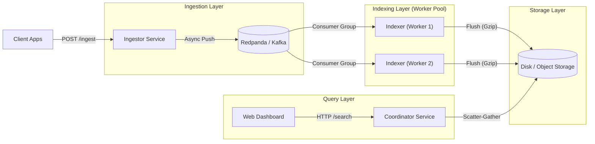

# Chronos ⚡
> A Distributed, Schema-less Event Storage & Analytics Engine.

Chronos is a high-performance log analytics platform built in Go. It is designed to ingest high-throughput event streams, store them in a compressed columnar format, and provide fast, distributed search capabilities.

## 🏗️ Architecture

Chronos follows a microservices architecture, decoupled by a message queue (Redpanda/Kafka).



### Components

1.  **Ingestor Service** (`:8081`):
    *   High-throughput HTTP gateway.
    *   Validates JSON events and assigns UUIDs/Timestamps.
    *   Asynchronously pushes to Kafka (Redpanda).

2.  **Message Queue** (Redpanda):
    *   Buffers events to handle backpressure.
    *   Distributes load across multiple Indexer workers via Consumer Groups.

3.  **Indexer Workers**:
    *   Consume events from Kafka.
    *   Buffer data in an in-memory **MemTable** (Columnar Block).
    *   Flush compressed columnar segments (`.json.gz`) to disk when a threshold is reached.
    *   Stateless and horizontally scalable.

4.  **Coordinator Service** (`:8082`):
    *   Serves the **Web Dashboard**.
    *   Exposes a **Scatter-Gather API** (`/search`).
    *   Queries all distributed segment files in parallel and aggregates results.

5.  **Storage Engine**:
    *   **Columnar**: Data is stored by column (Source, Message, Timestamp) for fast analytics.
    *   **Compressed**: Gzip compression reduces disk usage.
    *   **Partitioned**: Files are named with `timestamp_nodeID` to prevent collisions.

---

## 🚀 Quick Start

### Prerequisites
*   Go 1.21+
*   Docker & Docker Compose
*   Make (optional, but recommended)

### 1. Start Infrastructure
Start Redpanda (Kafka) and the Console.
```bash
make up
```

### 2. Run the Cluster
Open 4 terminal windows to simulate a distributed cluster.

**Terminal 1: Ingestor**
```bash
make run-ingestor
```

**Terminal 2: Worker 1**
```powershell
# Windows PowerShell
$env:NODE_ID="worker-1"; make run-indexer
# Linux/Mac
NODE_ID=worker-1 make run-indexer
```

**Terminal 3: Worker 2**
```powershell
$env:NODE_ID="worker-2"; make run-indexer
```

**Terminal 4: Coordinator**
```bash
make run-coordinator
```

### 3. Generate Load
Use the included load testing script to pump data.
```bash
go run scripts/load_tester.go
```

### 4. View Dashboard
Open **[http://localhost:8082](http://localhost:8082)** in your browser to search and visualize logs!

---

## 🛠️ Tech Stack
*   **Language**: Go (Golang)
*   **Messaging**: Redpanda (Kafka Protocol)
*   **Storage**: Custom Columnar Engine (JSON + Gzip)
*   **Frontend**: Vanilla HTML/CSS/JS (Glassmorphism UI)
